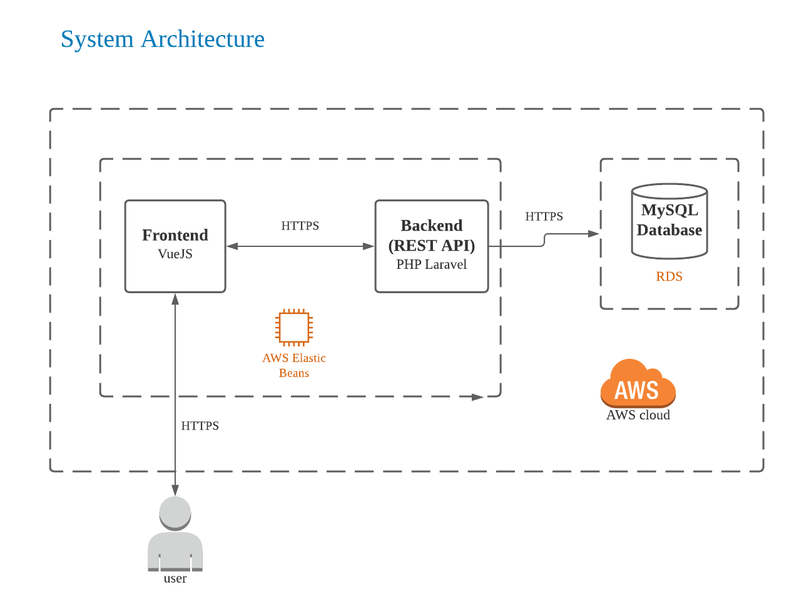
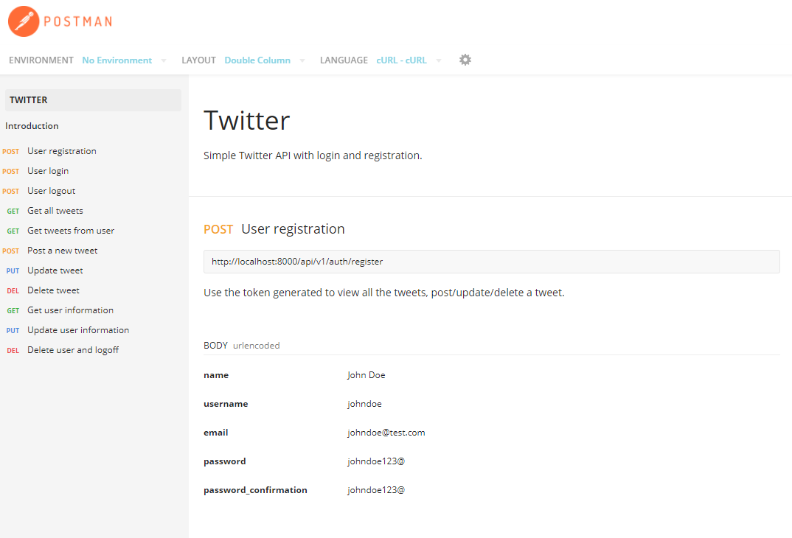
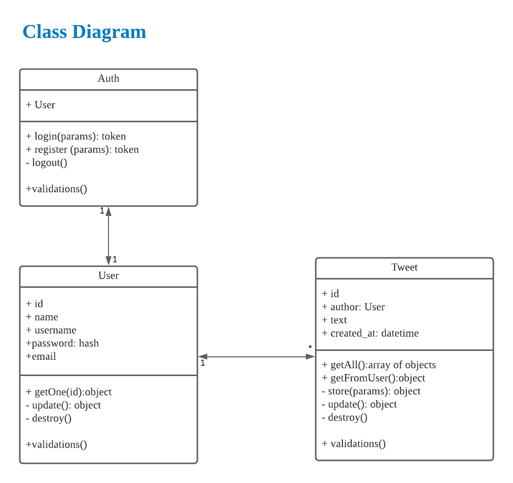

# Simple Twitter

## Table of Contents
- **[Introduction](#introduction)**
- **[Technologies](#technologies)**
- **[Setup](#setup)**
- **[APIs](#apis)**
- **[Tests](#tests)**
- **[Project Structure](#project-structure)**

## Introduction
Cloud-based backend service that emulates functionality similar to Twitter's Tweeting feature. Has a simple and basic frontend implementation to show the functionality.

[AWS deployment](http://twitter-linkx.ap-northeast-1.elasticbeanstalk.com/)

## Technologies
- VueJs 2.6.12
- PHP 7.3.1
- Laravel 8
- MySQL 8.0.2

## Setup
To run this project:
1. Clone this project.
2. cd simpleTwitter
3. Make a copy of .env.example file and create a new file: .env
4. Create a database named "twitter" inside your MySQL Database *
5. composer run-script first-initialization
6. php artisan serve
7. You can go to localhost:8000 to see the frontend

*In case you don't have MySQL/PHP installed, I recommend using XAMPP for a quick setup.

## APIs
Check below the list of endpoints:
* https://documenter.getpostman.com/view/11082955/TVYDfKf4

## Tests
### Add dummy data to DB
php artisan db:seed

### Run HTTP tests
php artisan test

## Project Structure

Used Laravel's official package [Passport](https://laravel.com/docs/8.x/passport) and header-based Token Bearer authentication scheme for user authentification.

Created verification in the routes to check if user has authorization to access the APIs.

PSR-4: Autoloads factories, seeders and tests and, added autoload for helper functions.

Used DRY principles.

Files created:

### Models
User: app/Models/User.php

Tweet: app/Models/Tweet.php

### Controllers
Authorization Controller: app/Http/Controllers/AuthsController.php

User Controller: app/Http/Controllers/UsersController.php

Tweet Controller: app/Http/Controllers/TweetsController.php

### Middlewares
Transform json automatically in return methods: app/Http/Middleware/ForceJsonResponse.php

Accept CORS: app/Http/Middleware/ForceJsonResponse.php

### Helpers
Error messages: app/Helpers/errorHelper.php

User: app/Helpers/userHelper.php

### Routes
API: routes/api.php

### Tests, Factories, Seeder
database/factories

database/seeders

tests/Feature

### Frontend code
VueJs code can be found here: resources/js

## Sources
- **[Laravel Documentation](https://laravel.com/docs)**
